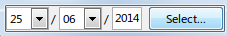
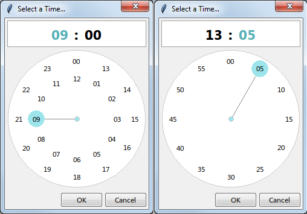
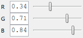
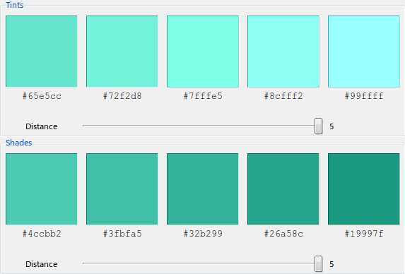

.. _gallery:

Gallery
=======

.. toctree::
   :hidden:

Shown below are examples of the widgets currently provided with tkStuff.

.. _gallery-date:

Date
----

   
   Date Entry Widget (See the :ref:`DateEntry <date-entry-class>` class)

.. figure:: .static/date_dialog.png
   :class: example
   
   Date Selection Dialog (See the :ref:`DateDialog <date-dialog-class>` class)

.. _gallery-time:

Time
----

.. figure:: .static/time_entry.png
   :class: example
   
   Time Entry Dialog (See the :ref:`TimeEntry <time-entry-class>` class)

The next 2 time selection dialog styles are chosen based on the Locale
e.g. for the `en_US` locale a 12 hour dialog is displayed.

.. figure:: .static/time_12_hour.png
   :class: example
   
   12 Hour Time Dialog Widget with AM/PM.
   (See the :ref:`TimeDialog <time-dialog-class>` class)

   
   24 Hour Time Dialog Widget with Separate Minute Selection (See the
   :ref:`TimeDialog <time-dialog-class>` class)

.. _gallery-color:

Color
-----

.. figure:: .static/color_entry.png
   :class: example
   
   Color Entry Widget (See the :ref:`ColorEntry <color-entry-class>` class)

.. figure:: .static/color_dialog.png
   :class: example
   
   Color Selection Dialog (See the :ref:`ColorDialog <color-dialog-class>` class)

.. figure:: .static/color_wheel.png
   :class: example
   
   Color Wheel Widget (See the :ref:`ColorWheel <color-wheel-class>` class)

   
   Color Slider Widget (See the :ref:`ColorSlider <color-slider-classes>` class
   and subclasses)

.. figure:: .static/color_square.png
   :class: example
   
   Color Square Widget (See the :ref:`ColorSquare <color-square-class>` class)

.. _gallery-color-palette:

.. figure:: .static/color_palette.png
   :class: example
   
   Color Palette Selector Widget (See the :ref:`PaletteSelector
   <color-palette-selector-class>` class)

   
   Tints and Shades Widgets (See the :ref:`ColorTint <color-tint-class>`
   and :ref:`ColorShade <color-shade-class>` classes)
   