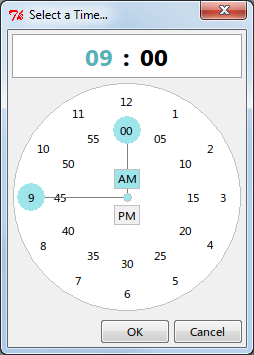

.. _gallery:

Gallery
-------

.. toctree::
   :maxdepth: 1
   :hidden:

Shown below are examples of the widgets currently provided with tkStuff.

Date
~~~~

.. figure:: .static/date_entry.png
   :class: example
   
   Date Entry Widget (See the :ref:`DateEntry <date-entry-class>` class)

.. figure:: .static/date_dialog.png
   :class: example
   
   Date Selection Dialog (See the :ref:`DateDialog <date-dialog-class>` class)

Time
~~~~

.. figure:: .static/time_entry.png
   :class: example
   
   Time Entry Widget (See the :ref:`TimeEntry <time-entry-class>` class)

   
   Time Selection Dialog (See the :ref:`TimeDialog <time-dialog-class>` class)

.. _Color:

Color
~~~~~

.. figure:: .static/color_entry.png
   :class: example
   
   Color Entry Widget (See the :ref:`ColorEntry <color-entry-class>` class)

.. figure:: .static/color_dialog.png
   :class: example
   
   Color Selection Dialog (See the :ref:`ColorDialog <color-dialog-class>` class)

.. figure:: .static/color_wheel.png
   :class: example
   
   Color Wheel Widget (See the :ref:`ColorWheel <color-wheel-class>` class)

.. figure:: .static/color_slider.png
   :class: example
   
   Color Slider Widget (See the :ref:`ColorSlider <color-slider-classes>` class
   and subclasses)

.. figure:: .static/color_square.png
   :class: example
   
   Color Square Widget (See the :ref:`ColorSquare <color-square-class>` class)

.. figure:: .static/color_palette.png
   :class: example
   
   Color Palette Selector Widget (See the :ref:`PaletteSelector <color-palette-selector-class>` class)
   